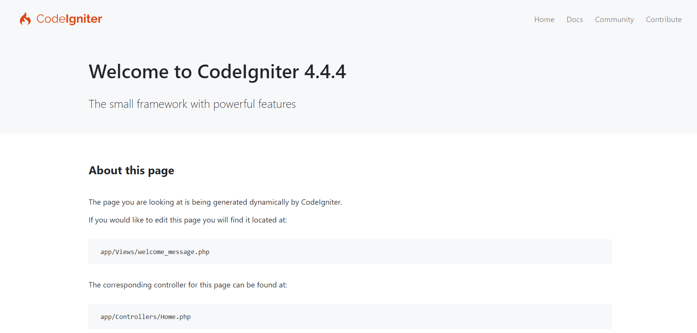

# 📂 CodeIgniter 4 Framework

## 📃 Orientações e estrutura inicial de um projeto utilizando o CodeIgniter 4 Framework

 

## 🚀 Tecnologias

- PHP
- PHP Orientado a Objetos
- Composer
- MySQL
- Visual Studio Code

 

## 💻 Projeto
> Frontend da aplicação 📸

  

[Acessar o projeto](http://localhost:8000)

 

## Preparando Ambiente

Instalação Manual
[Instalação Manual](https://codeigniter.com/download) 
Realize o Download e extraia na pasta do projeto.
  
[Instalação via Composer](https://codeigniter.com/user_guide/installation/installing_composer.html) 
Execute o comando abaixo

    composer create-project codeigniter4/appstarter project

### Iniciando aplicação
    php -S localhost:8000 -t public 

---
---
## 📧 Contato
[LinkedIn](https://www.linkedin.com/in/wsawebmaster/)

wsawebmaster@yahoo.com.br
